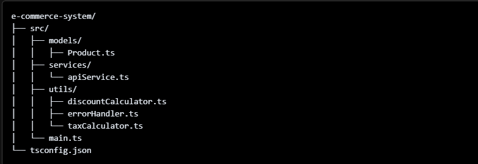

# Module 6 SBA TypeScript and Advanced JavaScript
## Lab Overview
The purpose of this project is to create an E-commerce Product Management System using TypeScript. The project should simulate a real-world application that allows users to:

- Create new Products by instancing them from a modular Product class. 
- Calculate the Discount dollar amount of any product.
- Calculate the Tax dollar amount applied to any product.
- Fetch the product catalog from the API.
- See Custom Error messages for clarity when an error occurs.
- View Product(s) details and final total price (includes discount subtracted and tax added).
------------------------------------------------
## Table of contents

- [Overview](#overview)
  - [GitHub](#github)
  - [How To Use](#how-to-use)
  - [My process](#my-process)
  - [Built with](#built-with)
  - [Reflection Questions](#reflection-questions)
  - [Useful resources](#useful-resources)
- [Author](#author)

### GitHub Link
https://github.com/ANIO-Official/e-commerce-system 
### How To Use
 1. Clone the repository or Download the ZIP file and extract the files.
 2. Open the file in Visual Studio Code.
 3. Open the Terminal using Ctrl + ~
 4. cd into the directory e-commerce-system
 5. Run the project using "node dist/main.js" 

    You should see the Terminal populate with information about the products 'clicked'. The examples clicked are products of id 1, 6,  and 8. You can simulate clicked a different product by changing the index number in the brackets ([]). 
    
    The product catalog from the API contains 196 products, so the index extends from 0-193. Items outside this range will return with the Indexing Error. Though when successfully indexed, (simulated click), you will see the following populate the terminal:

    1. Product Details: Title, ID, and category followed by the description on the second line, the base price on the third line, and finally the current discount percentage to apply to the product on the last line.
    2. Product Final Price/Cost: Following the product details, you will see a sentence referencing the product's titel and stating the final cost of the product after applying the tax and discount.
    3. Separator: A line of dashes to separate the product from the next one indexed.

 [Optional]
 There this a line of code commented out in main.js for your convenience. 
 
 " console.log(getAllProductInformation()) "  *line 43*

 This line of code will get **ALL** products' detail and final price information. I have commented it out to not overwhelm your terminal with 194 pieces of information. It can be hard to scroll. 
 But to view this interaction, uncomment out the code by removing the "//" infront it OR highlight the line of code and press ctrl + / to uncomment it. 

 It will load all 194 products to your terminal, each with the same formating as singular products.

## My process
Quick brief about process. Here are my steps/general steps:
 1. Project File Setup & Organization

  

 2. Research & Project Plan

  - Read the DummyJSON documentations for the Products API to see what url fetch with, understand what information the API provides for each product and how many there are.
  - Looked over project requirements to ensure clarity of duties.
  - Created a plan for each step in Windows Notepad.
  - Brought over plan notes as comments for referencing when building code.

 3. Implementation

  Performed steps according to plan:

  Step 1: Product Class
  
  - Created a product class and ensure all properties and the parameters of the constructor are typed for TypeScript type checking. 
  - Imported the taxCalcualtor and calculateDiscount functions from their respective modules. 
  - Used the functions to calculate final cost in the Product method getPriceWithDiscount. 
  
  Step 2: Create the functions for math based utility modules. 
  
  - Tested formulas for calculations in Windows Calculator and applying them to the code. 
  
  Step 3: Asynchronous Operations
  
  - Created the ansynchronous function to fetch the products from the API.
  - Parsed the data and cache specifically the products property (that holds all the products) to a variable to return upon execution.

  Step 4: Custom Errors
  
  - Created the custom Errors that extend from the Error class.
  - Based each on all possible errors to encounter such as fetching from the API, loading data, and attempting to access an invalid item.
  
  Step 5: Main Application
  
  - Import all necessary information: Product class, all API service exports, and the applicable custom Errors. Run the main fetchProducts function of apiService module.
  - Created an array called products that holds the new Product instances created from the data returned
  - Created two functions: one to simulate clicking a single product, and one to simulate viewing all products. 
  - Created example executions by console logging the results of calling the functions.

 4. Compiling, Testing, Refactoring, Commenting, & Bug Fixing

  - Compiled code using **npx tsc**
  - Checked for bugs when running code and corrected issues when found.
  - Looked over each module to check for any areas needing up naming convention, formula logic, or error handling updates.
  - Refactored code as necessary
  - Updated comments to match refactored code.

### Built with
- TypeScript

## Reflection Questions

 1. **How I implemented TypeScript features and OOP principles**

  I used TypeScript all throughout my process to type variables, class properties, function retuns, and function parameters. This helped TypeScript alert me whenever I was returning, referencing, or inputing incorrect data. It streamlined the bug fixing necessary because I knew exactly what behavior I needed to research and/or check. As for OOP principles, using the concept of inheritance, I created 3 custom Error classes: DataError, FetchError, and IndexingError which extend from the parent class Error. Addditonally, I created a base Product class and instanced new Product objects using the data from the API.

 2. **Challenges I encountered and solved**

  A lot of the challenges I faced occurred towards the end of the project. Specifically when I went back to test and bug test the code. 
  ----------------------------------------------------------------------
  Challenge 1: Incorrect Formulas
  
  This was small challenge. Though I tested and found that the code worked, I noticed the calculations returned negative values. The blame lied in the formulas I used for my tax and discount modules. 
  
  I tested my formulas in a calculator but did not realize I was converting the percentages to their decimal values in the calculator **BUT NOT** converting it in my code. I also found that I was accidentally subtracting instead of adding the tax amount. These reasons explained the negative final cost in the Product class' getPriceWithDiscount method. I updated the code to divide the Percentages by 100 and updated the formula to add the tax. The final cost returned correctly after these changes.

  ----------------------------------------------------------------------
  Challenge 2: Error Type Corrections

  I bug tested the code by checking for products outside the array index. I found that often a Type Error would appear in place of my custom errors. Going back and editing my try catch blocks, I adjusted my catches to log the errors to the console using 'console.error' instead of just throwing the errors. Inside the apiService module I also ensured that the ok property conditional check for the API response would return stopping any further code from continue invalid data. Instead, warning the user that fetch attempt failed with the FetchError class.

  Additionally, I noticed an overlook of handling products outside the product array index. To remedy this, I added 1 new error class called 'Indexing Error' to handle products with no valid id that would exist in the array. Products with negative id's or ones beyond the length of the arrray will return invalid. 
  
  Specifically this data set from the API follows a organizational id numbering system that matches the product to it's actual count in the array. So, when a product is added to the system with incorrectly organized id (i.e. the 195th product has an id of 901), it will return invalid. This works well because my error will alert the user that the id is invalid, leading them to check what it's current id is and fix it.

  ----------------------------------------------------------------------
  Challenge 3: Product Array Undefined

  The base logic behind the main application is:
  
   1. To call the fetchProducts function in the apiService module & wait for fetch request to return the data. 
   2. Create new products with the returned object array from the parsed data in the apiService module.
   3. Cache the resulting new Product instances to an array called products.
   4. Reference this array to get any data necessary. In this case, the two methods are the data being used per product in the main application's functions **getProductInformation()** (that simulates clicking a specific product to view it's information) and **getAllProductInformation()** (that simulates loading a formated page full of all product information.)

   It was solid logic but I ran into the issue of the products array returning undefined. With undefined values, I cannot run the Product methods because there would be no products. After analyzing my code, I realised my updated value for the products array remained at block level scope within the asynchronous function I placed it in. TypeScript warned me of this when I attempted to call my function to display the product information. I also double check by logging the value of the products array in the console at both block scale and global scale. 

   I needed the products variable to await for the results to return before assigning a value to products. Assigment of   products occurs much faster than the fetchProducts function, and I want products to wait its turn. But placing products variable inside an async function would only keep that updated value within the block scope of the trycatch even after running the async function. I tested this in OneComplier with a simpler version of my logic to check this was true, and it was: I could not access the value outside the trycatch.

   To recap: Without await, products will always return undefined. However, when products is assigned within the trycatch of an async/await function, I can't access the values. The **final solution** that made sense was to perform them both at global scale. MDN states **await "can only be used inside an async function or at the top level of a module."**  ⚆_⚆ I needed this.

   Refactoring my code, I moved the entire process (2 lines of code) to global scope. The Result? Product finally returning the correct values (product objects). This solution was much cleaner, efficient, AND solved the scope problem. Any error handling for the fetch request is still implemented in the apiService module resulting addressed errors before the products assignment occurs.

   Side note: Putting it in a trycatch at global *also* produced the same issues.
  

 3. **Handling asynchronous operations and error management**

  To handle all asynchronous operations, I placed each within an async function which implies a returned Promise. Each step awaited for the previous to finish before moving on to ensure the Promise returned. For error handling, I created custom Error classes and placed my async operations within a trycatch of the sync funtions that applies the applicable custom error.

### Useful resources

- [MDN array.prototype.map()](https://developer.mozilla.org/en-US/docs/Web/JavaScript/Reference/Global_Objects/Array/map) - I really love for of and for in, but I wanted to try map() as it would be important when moving onto REACT. So I took some time to read and understand how to use map for arrays. It was fairly easy to use! I like that it solved my need in essentially 1 line of code.
- [One Compiler recommended by Jackson Jacque](https://onecompiler.com) - Helpful to test ideas without the need to branch out the code. I specifically wanted to work the logic behind my createProducts function (ultimately became the getProductIngormation()). The products array kept returning undefined and I wanted a way to break down what I was *actually* doing that caused this behavior. Since the edit would be this one block of code, I took to OneCompiler. A resource suggested by peer Jackson.
- [MDN await](https://developer.mozilla.org/en-US/docs/Web/JavaScript/Reference/Operators/await) - Helped solved my products value issue. I read the description of how to best use await because I wanted to see if I could use it without an asynchronous operation. I remembered that async cannot be without await but I didn't hear that await needed async.  So I researched and found here that *I could infact use it at top level!* Approaching it this way, worked better with the way I wanted the logic to flow in the main application. I needed the fetch to complete before moving onto the mapping and instancing of the new products. Else the prodcuts array would return undefined still. 
- [Dummy JSON API](https://dummyjson.com/docs/products) - API containing products used for this application. Referenced for proper fetching of all products.
- Module 6 All Lessons (1-9) - I went back to the lessons many times to double check my understanding of how to apply concepts. This module is *very thorough* so it was a big help when completing this project.

## Author

- LinkedIn - [Amanda Ogletree](https://www.linkedin.com/in/amanda-ogletree-a61b60168)